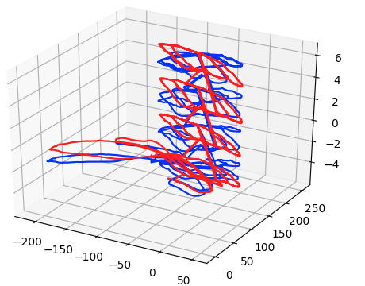
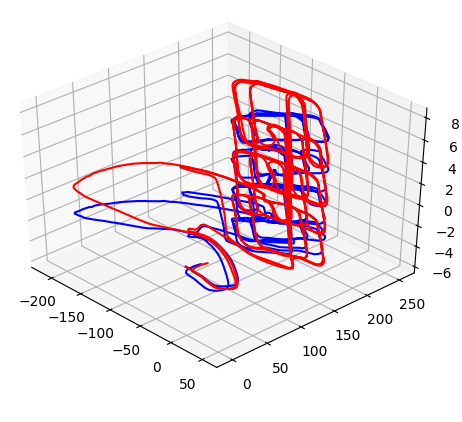
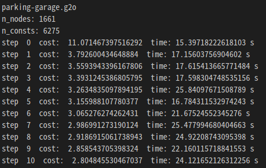

# PoseOptimizationSLAM3D
3D (x, y, z, qw, qx, qy, qz) pose optimization SLAM

1. Download data  

~~~
python pose_optimization_slam_3d.py
~~~

2. run SLAM 

~~~
python pose_optimization_slam_3d.py
~~~

# Result

parking-garage.g2o data

step 1  
  

step 10  
  
 
standard output  
  

# Reference 
[A Compact and Portable Implementation of Graph\-based SLAM](https://www.researchgate.net/publication/321287640_A_Compact_and_Portable_Implementation_of_Graph-based_SLAM)  
[GitHub \- furo\-org/p2o: Single header 2D/3D graph\-based SLAM library](https://github.com/furo-org/p2o)  
[GitHub \- AtsushiSakai/PythonRobotics
/SLAM/PoseOptimizationSLAM](https://github.com/AtsushiSakai/PythonRobotics/tree/master/SLAM/PoseOptimizationSLAM)
